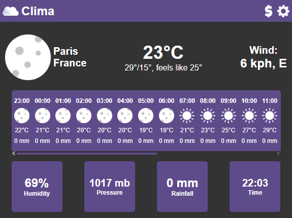

# What is clima?

Clima is an extension for Google Chrome or Opera browser that provides users with up-to-date weather information. Thanks to its convenient settings and intuitive interface, you will always be aware of current and upcoming weather conditions in the cities of your choice.

# Main features

### Settings:

- Clock format: 12-hour or 24-hour.
- Select a city to receive the weather forecast.
- Units: Celsius or Fahrenheit for temperature, metric or imperial system for other parameters.

Click on the gear in the upper right corner to open the settings.

### Basic information:

- Wind speed and direction.
- Temperature.
- Minimum temperature.
- Maximum temperature.
- Temperature as felt.

### Forecast 24 hours ahead:

- Time.
- Weather icon.
- Temperature.
- Precipitation.

### Additional information:

- Local time.
- Humidity.
- Precipitation.
- Pressure.

# Installation

1)Download the unzipped Clima extension from GitHub (ZIP archive).
2)Unzip the archive to your desktop.
3)Open Google Chrome browser and go to chrome://extensions/.
4)Enable developer mode by toggling the corresponding toggle switch in the upper right corner.
5)Click the "Download unzipped extension" button and select the folder with the extension unzipped on your desktop.
6)Clima will appear in the list of extensions. Click on the extension icon in your browser to open the Clima interface and customize the settings according to your preferences.

# Usage
1)Set the desired parameters in the Initial Setup window. After the initial setup, you can change the parameters in the settings (see section Settings).
2)Check out the weather forecast!
